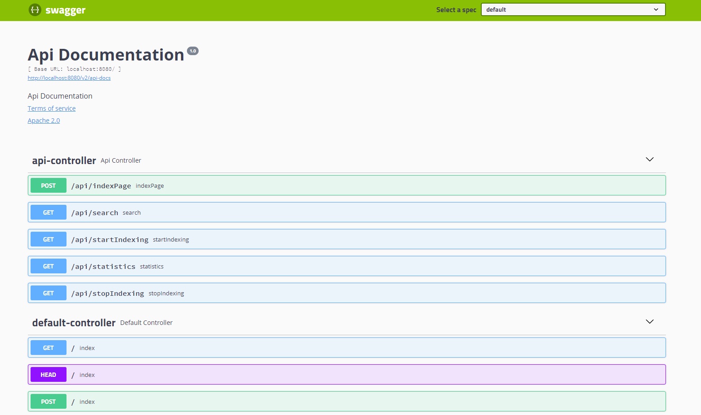

# Поисковый движок по сайтам.
Позволяет индексировать страницы сайтов и осуществлять по ним быстрый поиск необходимой информациии

<h2 align="center">

</h2>

---
# Оглавление
- [Описание](#Описание)
- [Локальный запуск](#Как-запустить-локально)
- [Запуск веб-интерфейса](#Запуск-веб-интерфейса)
- [База данных](#База-данных)
- [Интерактивная документация](#Интерактивная-документация)
- [Используемые технологии](#Используемые-технологии)
- [Обратная связь](#Контактные-данные)

___
## Описание:
Данное приложение представляет собой веб-сервис, который обрабатывает HTTP-запросы и ответы, используя REST/JSON для передачи данных между клиентской и серверной сторонами, имеет простой веб-интерфейс и API, через который им можно управлять и получать результаты поисковой выдачи по запросу. Приложение написано на языке Java и использует Spring Framework для реализации RESTful веб-сервиса, работает с базой данных PostgreSQL.


### Принципы работы поискового движка

- В конфигурационном файле перед запуском приложения задаются адреса сайтов, по которым движок должен осуществлять поиск.
- Поисковый движок самостоятельно обходит все страницы заданных сайтов и индексировать их (создавать так называемый индекс) так, чтобы потом находить наиболее релевантные страницы по любому поисковому запросу.
  - Реализована функция остановки индексации.
  - Имеется возможность индексации конкретной страницы.
  <h2 align="center" style="margin: 0; padding: 0;">

  </h2>
 
- Пользователь присылает запрос через API движка. Запрос — это набор слов, по которым нужно найти страницы сайта.
- Запрос определённым образом трансформируется в список слов, переведённых в базовую форму. Например, для существительных — именительный падеж, единственное число.
- В индексе ищутся страницы, на которых встречаются все эти слова.
Результаты поиска ранжируются, сортируются и отдаются пользователю.

  <h2 align="center" style="margin: 0; padding: 0;">

  </h2>
____

## Как запустить локально:

Для того, чтобы запустить проект локально вам необходимы JDK от 11 версии, система контроля версий git, сборщик проектов Maven.

Скачать проект можно используя git bash:

    git clone https://github.com/NikolaiMagritte/search-engine.git
После скачивания проекта, необходимо создать локальную базу данных, и изменить параметры подключения к базе данных в конфигурационном файле <u>application.yaml</u>.

````
spring:
  datasource:
    username: ${Postgres_USERNAME}
    password: ${Postgres_PASSWORD}
    url: jdbc:postgresql://localhost:5432/search_engine
````
Необходимо изменить имя пользователя, пароль и URL-адрес базы данных. В данном случае, используется база данных PostgreSQL, которая находится на локальном сервере и имеет название "search_engine". Имя пользователя и пароль выведены в переменные окружения.

Далее, посредством Apache Maven необходимо собрать проект, используя команду:

    mvn clean install

Запуск проекта: 

    java -jar SearchEngine-1.0-SNAPSHOT.jar

Запуск проекта, если изменения в имя пользователя и пароль не вносились: 

    java -jar SearchEngine-1.0-SNAPSHOT.jar --spring.datasource.username=<usernameDB> --spring.datasource.password=<passwordDB>

____
## Запуск веб-интерфейса:

Для работы с веб интерфейсом необходимо в браузере перейти на веб страницу:

    http://localhost:8080/


В проекте, посредством Spring Security реализована авторизация:

<h2 align="center" style="margin: 0; padding: 0;">

</h2>
Для подключения введите:

    Username: root
    Password: root
Теперь веб-интерфейс доступен для работы:
<h2 align="center" style="margin: 0; padding: 0;">

</h2>

____
## Интерактивная документация:
К данному проекту подключены библиотеки Swagger для автоматической генерации документации по реализованному API и для удобства его тестирования.
<h2 align="center" style="margin: 0; padding: 0;">

</h2>

Для просмотра документации для всех методов API, которые определны в контролерах, запустите приложение и перейдите по ссылке:

    http://localhost:8080/swagger-ui.html


    
____
## База данных:

В качестве базы данных используется PostgreSQL на локальном сервере.

Структура базы данных в виде ER-диаграммы:

<h2 align="center" style="margin: 0; padding: 0;">

</h2>
____

## Используемые технологии:

- Spring (Boot, MVC, Data, Security)
- PostgreSQL
- JPA (Hibernate)
- Apache Lucene
- Jsoup
- REST
- JSON
- Slf4j
- Lombok
- Swagger
- HTML
- CSS
- JavaScript
- Thymeleaf
- jQuery
- Maven

____

## Контактные данные

✉ Почта для обратной связи:
<a href="mailto:NMagritte@ya.ru&body=Привет, у меня есть вопрос по твоему дипломному проекту.">NMagritte@ya.ru</a>


✪ Ссылка на решение задач по Java:
https://dzen.ru/01101010011000010111011001100001